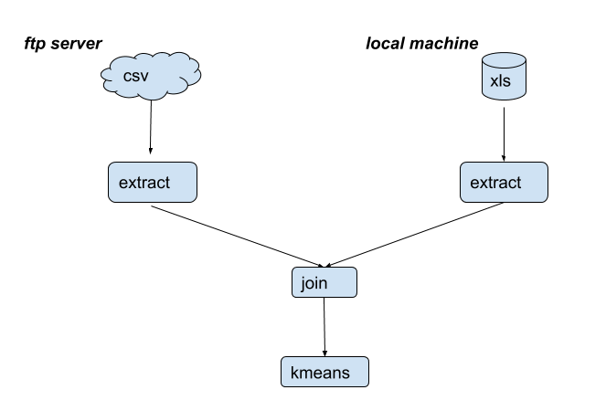
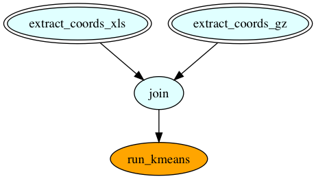
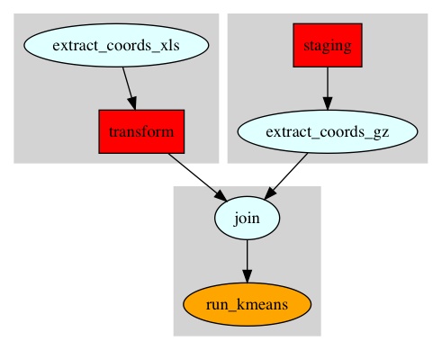

[](https://travis-ci.org/chamibuddhika/kisseru)


# kisseru

Kisseru lets you script your data pipelines. No need to learn another framework or another DSL. Just write pipeline tasks as plain python functions. And then chain the function calls the way you need the data to flow in the pipeline and you are done!!

You can take the pipeline and run it locally in your machine (or in a cluster or in a cloud if you want it to scale -- these modes still in the works) and Kisseru will figure out how to run it most efficiently without you having to worry about it.

(煙管 kiseru) is a Japanese "pipe".  Yes we know we mistyped it a bit with the double `s` :). But we also have KISS (Keep It Simple Stupid) as the defining principle behind this library. So we thought we start the name with that.

# Example

## A Data Pipeline for Clustering

Instead of the usual hello world example we are going to show an
actually useful fully functioning example which demonstrates most of the key
features of Kisseru. Even though it covers a reasonable breadth it
is simple enough to fit as an introductory example since we don't have to
explain lot of fluff to get to the actual use case as many frameworks have to.

### How to Run

Kisseru requires python 3.5+ and a pip3 installation. In order to install Kisseru
run pip3 as follows.

```pip3 install kisseru```

Now download the Kisseru repository containing the example using git as follows.

```git clone git@github.com:chamibuddhika/kisseru.git```

Example is under `examples/clustering` under the the repository root directory.
Do the following to run the example.

```bash
  cd examples/clustering
  python3 cluster_app.py
```

Now you should be able see the output from the example run.

### Description

The use case we cover with this example  is as follows.
* We want to cluster geographic locations where hail storms occurred during previous two years.
* Data for 2017 is in a ftp site as a csv file while we have the data for 2016
locally as an Excel file.
* We want to extract latitude and longitude information from both these data files, join them and then run kmeans clustering on joined data file to find geographical clusters where hailstorms occurred during last two years.

The first step is to identify the steps in the pipeline. We identify them as
1. Fetching the ftp resource. We also call this input staging.
2. Extract the coordinate data from fetched file and save it to a temporary file.
3. Extract the coordinate data from our local Excel file and save that as well.
4. Now join the data from these two files to get a combined data file.
5. Finally run the kmeans clustering analysis and generate the cluster plot.

So the pipeline looks like this.



With Kisseru each of these steps is just a plain python function. Let's pretend
for a moment that we already have the ftp resource staged. Now we have to
extract the coordinates from it. We write a function which accepts the locally staged file path as `infile` as follows.

```python
from kisseru import *

@task()
def extract_coords_from_csv(infile) -> csv:
        # Read the csv, extract lattitude and longitude
        # columns and save it as a new csv file
        # Finally return the new csv file path
```

Two things to note here.
1. `@task()` : This just says that this is a Kisseru task. Don't need to think much on that other than putting it in there.
2. `-> csv` : This says that the output of the function is a csv file. In reality we actually return the path of the file as a python string. But denoting it as `csv` helps Kisseru to do some interesting stuff to reduce the amount of code you need to write. You will see soon!

That's it! You've defined the first Kisseru task. Of course you have to acutally write the code to do the stuff described in the comments. We just elide it for brevity. Now let's define a similar function to extract coordinates from the Excel file.

```python
@task()
def extract_coords_from_xls(infile) -> xls:
        # Read the Excel file, extract lattitude and
        # longitude and save it as a new Excel file
        # Finally return the new Excel file path
```

Note the return type is now `xls` for a Excel file.

Now what's left to do is to join the temporary file data and run the analysis. Let's join the data files first.

```python
@task()
def join(staged, local : csv) -> csv:
        # Concatenate data files and generate a combined 
        # csv file 
        # Finally return the combined csv file path
```

Here `staged` is the extracted data file coming from original staged csv file. `local` is the extracted data file coming from `extract_coords_from_xls`. One interesting thing here. We say `local : csv`. Which means we only accept a csv file as the second parameter. It just makes our life easy within the `join` function since we don't have to deal with two file types. But remember `extract_coords_from_xls` returns an Excel file so we cannot pass it to `join` as it is. Or can we? What gives?...

There are certain data type transformations that Kisseru knows how to do. Excel to csv is one of them. When you pass an Excel file to a function which expects a csv, Kisseru will do the dirty work of doing the transformation in the background and pass the file with correct format to your function. Think of it as a implicit type conversion that you can find in many a language (i.e: like when you pass an `int` to a function accepting a `long`). An as any such language, if you try to pass something which is not by default convertible, Kisseru will let you know it as a compiler error when it compiles the pipeline.

Anyways, as we previously promised now you can see why providing type information becomes useful. It helps Kisseru  reduce the boilerplate code you need to write. Kisseru requires user to provide the return data type at a minimum and input data types optionally. But if you would like to have **free** data transformations as above, be sure to specify the input data types and enjoy your **free** beer (or your favorite non alcoholic beverage if you are not 
in to that whole drinking thing)!

Okay, almost done. We are now done with input data preprocessing. The final step is to actually run the kmeans analysis on the combined data file. Now let's write the `run_kmeans` task which takes in the input file having the combined data and run kmeans analysis on it.

```python
@task()
def run_kmeans(infile) -> png:
    # Run kmeans on infile and generate a plot
    # Return the plot file path
```

Here we return the plot as a `png` file. Now we have all the steps in the pipeline. All that's left is to stitch it together and run it. Let's do that now.

```python
@app()
def cluster_app() -> png:
        ftp_csv = 'ftp://noaa.gov/../hail-2017.csv'
        local_xls = 'hail-2016.xls'

        staged = extract_coords_from_csv(ftp_csv)
        local = extract_coords_from_xls(local_xls)
        combined = join(staged, local)
        plot = run_kmeans(combined)
        return plot
```

Two things here. `@app` just says this is a special function which defines a pipeline which is basically a bunch of tasks stitched together with function calls.

And also did we just pass a ftp URL to our `extract_coords_from_csv` which which we earlier presumed to accept a local file??#$!

**Yes**, we just did!!! 

Again Kisseru figures out that this a remote resource by looking at the resource URL and automatically does the staging for you. So no figuring out how to talk ftp in your code or worse yet doing that step manually. 

That's it! We are done. We have defined the tasks and the pipeline along with it. There was nothing fancy but plain python code with bit of annotations sprinkled in.

Okay, now let's run our pipeline.

```python
if __name__ == "__main__":
  app = AppRunner(cluster_app)
  app.run()
```


`AppRunner` accepts our pipeline as its input and then runs it when we call
`run()` on it.

Below is the pretty output generated by our pipeline. Apparently there are three
geo clusters where hail storms happened in two previous years!!


We are done with our tutorial. But if you are interested in knowing a little bit more about how Kisseru works, also check out the section on [How It Works](#how-it-works). Meanwhile we have some more goodies for you if you are hooked!

## Scripting Inlined

Let's say you think bash is the greatest scripting language (behind python -- just kidding) to grace this planet. Cool! So you think you can easily whip up a small bash script to extract the latitude and longitude columns from the csv file in place of bunch of python code in `extract_coords_from_csv`. We hear you...

So what we did was to make it possible to write an inlined bash script or a bash command line within your function just as you would in a regular bash script or at bash prompt. For example let's see how we could have written an inlined bash script within `extract_coords_from_csv` 

```python
@task()
def extract_coords_csv(infile) -> csv:
    '''bash
    cat %{infile} | cut -d, -f2,3 > hail-2017-filtered.csv
    %{outfile}=hail-2017-filtered.csv
    '''
    return outfile
```

We start the inlined bash script with the preamble `'''bash` and end it with `'''`. So basically the whole thing is a python comment which the python interpreter ignores. But Kisseru intercepts it and runs it for you. 

Also note how we refered to the python variable `infile` within the script using `%{}` notation. We can also write to a python variable within our inlined script like we did with `outfile`. This is useful for getting any bash command output to python and pass it to a later task in the pipeline as we did here. Also if there is no existing python variable definition it also defines it when written within the inlined script, also as is the case here. 

## How It works

Now let's talk a little bit about how Kisseru works behind the scenes. This section is for advanced readers and potential contributors to Kisseru and  you don't need to understand this section in order to use Kisseru. 

In our clustering pipeline example `AppRunner` does not run the pipeline straight away when you call `run()` on it. First it will compile the pipeline and validates it to see if user has done any errors like passing incorrectly typed data etc. If it finds any, it will immediately inform the user by throwing a compiler errror. 

We think failing fast is better than knowing something went wrong due to a wrongly typed data input once the pipeline has run for a day or two. It could very well happen since python only catches such errors at runtime since it is **dynamically** typed. We like the productivity of python language but with our pre-run compile step we try provide some of the safe guards of a **statically** typed language.

As the next step the runner will figure out any data transformations and staging operations it needs to do and then inserts them to the user provided pipeline. In our clustering app the original user defined pipeline looks like this.



Pipeline sources are double bordered and sink is orange colored. However the final pipeline generated by Kisseru looks like the one below.




The tasks in red squares are Kisseru generated tasks for data staging and data transformation. These before and after
task graphs were generated during the compiler pipeline run. 

As another compiler optimization we group the sequential task regions in the task graph so that they will be run in the same process. We call this optimization task fusion. Here we can see the optimizer fused the graph to three regions. Each region is shown as a grayed out square. As a result of this optimization intermediate results of the fused tasks will not be written disk.


Finally, after above pipeline optimization step Kisseru generates code to run the pipeline on the specific back end user wants it run (e.g: on a HPC cluster using Slurm) and then submit the pipeline job to be run. In this example we just ran it locally. For running it on clusters user can provide the required connection data to the AppRunner. Facility for running Kisseru pipelines on clusters is is still in the works.
